# PLATAFORMAS DESCARTADAS

## La Script del ChatBot

Este script de Python usa Flask para crear un servidor web que implementa un chatbot con el modelo DialoGPT-medium de Microsoft. Importa las bibliotecas necesarias, carga el modelo y el tokenizador, y define rutas para renderizar la interfaz de chat y procesar mensajes del usuario. Una función maneja las respuestas del chatbot mediante iteraciones y generación de respuestas. Si se ejecuta directamente, inicia el servidor Flask. En resumen, ofrece una interfaz de chat para interactuar con el chatbot DialoGPT-medium.

# IMAGENES DEL PROCESO

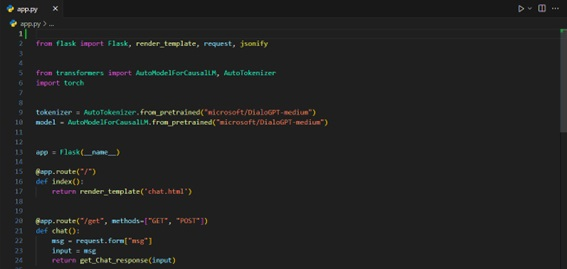
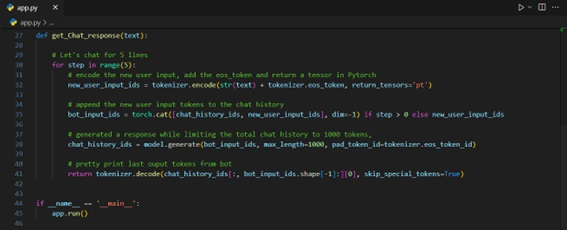

-------------------------

## El html del ChatBot

El fragmento de código HTML y JavaScript crea una interfaz de chat con un chatbot. Se incluyen estilos CSS, Bootstrap y jQuery para la interfaz de usuario. Se estructura el HTML con un contenedor principal, una fila y una columna para el chat. Se crea una tarjeta para el chat con encabezado, cuerpo y pie. El encabezado muestra el nombre del chatbot y un mensaje de bienvenida. El cuerpo muestra los mensajes de la conversación. Hay un formulario para enviar mensajes al chatbot con un campo de entrada de texto y un botón de enviar. El script JavaScript maneja el envío y recepción de mensajes entre el usuario y el chatbot mediante AJAX. En resumen, se crea una interfaz de chat interactiva para interactuar con el chatbot en tiempo real.

# IMAGENES DEL PROCESO

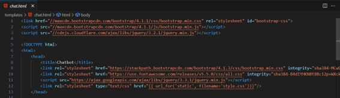
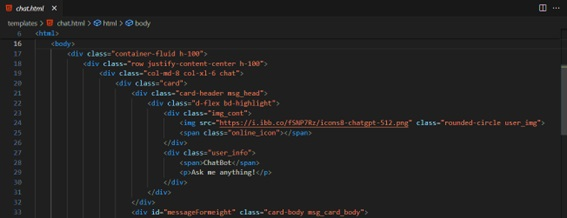
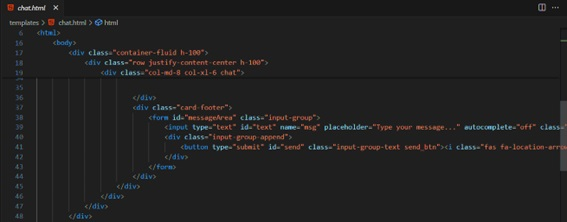
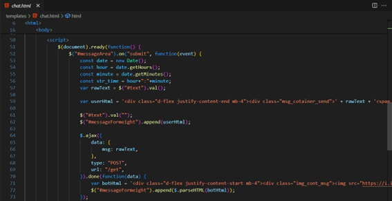
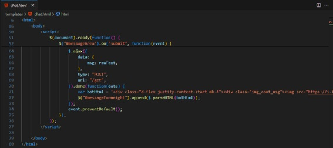
-------------------------

## Estilo del CSS para el ChatBot

El código CSS proporciona estilos para una interfaz de chat, incluyendo la configuración del tamaño del cuerpo y del documento, el fondo con gradientes lineales, estilos para la tarjeta de chat, encabezado, pie de tarjeta, campos de entrada de texto, botones, lista de contactos, imágenes de usuario, iconos de estado en línea y mensajes enviados y recibidos. Se utilizan media queries para ajustar los estilos en dispositivos de pantalla más pequeña.

# IMAGENES DEL PROCESO

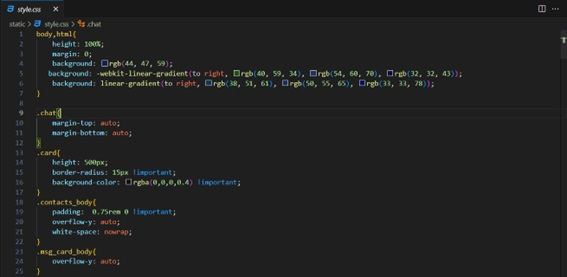
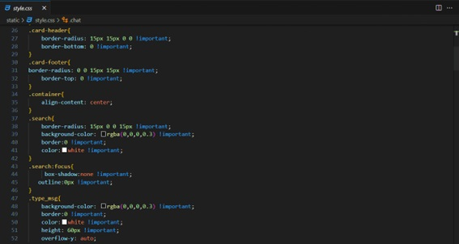
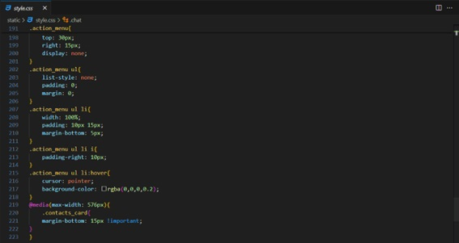

---------------------

## Uso del archivo Requerimientos

El archivo **"requirements.txt"** especifica las dependencias de un proyecto Python. Incluye Flask para desarrollo web, transformers para usar modelos de lenguaje avanzados y PyTorch para aprendizaje profundo. Al ejecutar **pip install -r requirements.txt**, se instalan automáticamente estas dependencias, facilitando la ejecución del proyecto sin necesidad de instalar cada biblioteca por separado.

# IMAGENES DEL PROCESO

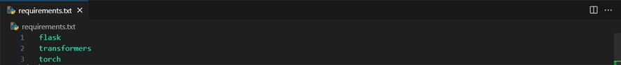